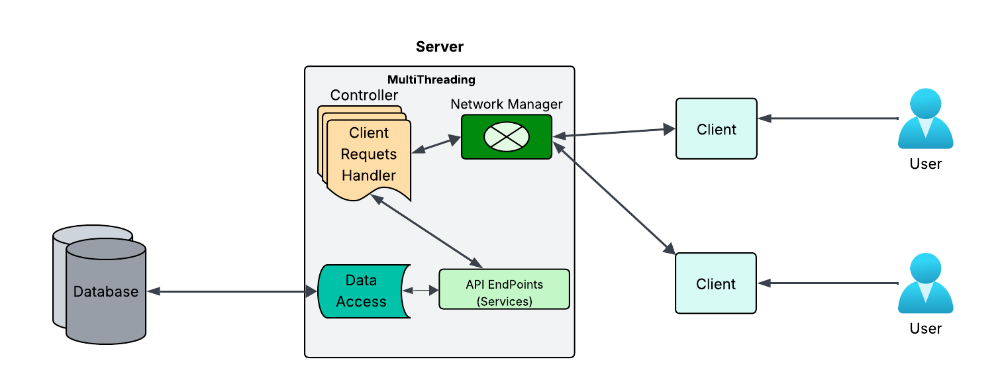
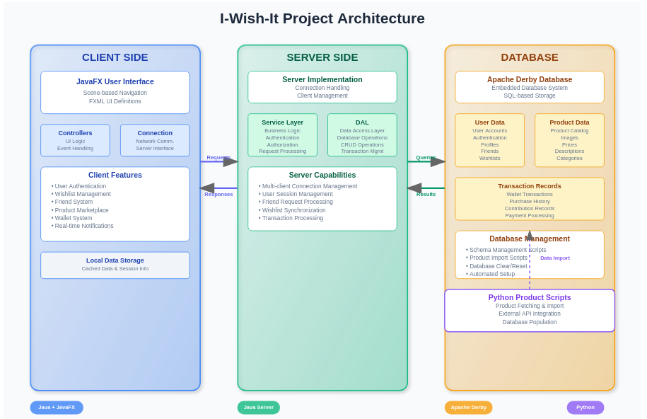

# 🎁 I-Wish-It

[](https://www.oracle.com/java/)
[](https://openjfx.io/)
[](https://db.apache.org/derby/)
[](https://www.python.org/)

**I-Wish-It** is a comprehensive Java-based wishlist management application that enables users to create, manage, and share wishlists with friends while contributing to each other's wishes. Built with a robust client-server architecture and featuring a modern JavaFX interface, this application provides a complete social wishlist experience.



## ✨ Features

### 🔐 User Management
- **Secure Authentication**: Sign up and sign in with encrypted credentials
- **User Profiles**: Personalized user accounts with profile management
- **Session Management**: Secure session handling with automatic logout

### 👥 Social Features
- **Friend System**: Send and receive friend requests
- **Friend Discovery**: Find and connect with other users
- **Social Wishlist Sharing**: Share your wishlists with friends
- **Real-time Notifications**: Get notified about friend requests and wishlist updates

### 🎯 Wishlist Management
- **Create Multiple Wishlists**: Organize wishes into different categories
- **Wishlist Privacy Controls**: Public, friends-only, or private wishlists
- **Item Management**: Add, edit, remove, and prioritize wishlist items
- **Wishlist Sharing**: Share specific wishlists with selected friends

### 🛒 Marketplace & Products
- **Product Catalog**: Browse extensive product database with images
- **Product Search**: Find products by name, category, or price range
- **Product Details**: Detailed product information with images and descriptions
- **Price Tracking**: Monitor product prices and availability

### 💰 Contribution System
- **Digital Wallet**: Secure wallet system for managing contributions
- **Contribute to Friends**: Help friends achieve their wishes by contributing funds
- **Transaction History**: Complete record of all contributions and transactions
- **Payment Processing**: Secure payment handling for contributions

### 🔔 Real-time Features
- **Live Notifications**: Instant updates for friend requests and contributions
- **Status Updates**: Real-time wishlist and friend activity updates
- **Synchronization**: Automatic data sync across all connected clients

## 🏗️ Architecture Overview

I-Wish-It follows a **3-tier client-server architecture**:



```
┌─────────────────┐    ┌─────────────────┐    ┌─────────────────┐
│   CLIENT TIER   │───▶│   SERVER TIER   │───▶│ DATABASE TIER   │
│                 │    │                 │    │                 │
│ • JavaFX UI     │    │ • Business Logic│    │ • Apache Derby  │
│ • Controllers   │    │ • Authentication│    │ • User Data     │
│ • Network Comm. │    │ • Data Access   │    │ • Products      │
│ • Local Cache   │    │ • Session Mgmt  │    │ • Transactions  │
└─────────────────┘    └─────────────────┘    └─────────────────┘
```


### Key Architectural Benefits
- **Scalability**: Multi-client support with centralized server
- **Security**: Server-side authentication and data validation
- **Performance**: Client-side caching and optimized database queries
- **Maintainability**: Clear separation of concerns across tiers

## 📁 Project Structure

```
I-Wish-It/
├── 📂 client/                     # Client-side application
│   ├── 📂 src/
│   │   ├── 📂 controller/         # UI Controllers (MVC Pattern)
│   │   ├── 📂 scene/              # FXML UI Definitions
│   │   ├── 📂 connection/         # Network Communication
│   │   ├── 📂 model/              # Data Models
│   │   └── 📂 util/               # Utility Classes
│   ├── 📂 resources/              # UI Resources (FXML, CSS, Images)
│   └── 📄 build.xml               # Ant Build Configuration
│
├── 📂 server/                     # Server-side application
│   ├── 📂 src/
│   │   ├── 📂 service/            # Business Logic Layer
│   │   ├── 📂 dal/                # Data Access Layer
│   │   ├── 📂 connection/         # Network Handling
│   │   ├── 📂 model/              # Data Transfer Objects
│   │   └── 📂 util/               # Server Utilities
│   └── 📄 build.xml               # Ant Build Configuration
│
├── 📂 database/                   # Database Scripts & Schema
│   ├── 📂 schema/                 # SQL Schema Definitions
│   ├── 📂 data/                   # Sample Data Scripts
│   └── 📂 migration/              # Database Migration Scripts
│
├── 📂 scripts/                    # Automation Scripts
│   ├── 📂 python/                 # Python Product Scripts
│   │   ├── 📄 fetch_products.py   # Product Data Fetcher
│   │   ├── 📄 requirements.txt    # Python Dependencies
│   │   └── 📄 install_requirements.bat
│   ├── 📄 derby-schema-apply.bat  # Apply Database Schema
│   ├── 📄 derby-schema-clear.bat  # Clear Database
│   ├── 📄 derby-insert-products.bat # Insert Product Data
│   ├── 📄 start-iwishit-server.bat # Start Server
│   └── 📄 start-iwishit-client.bat # Start Client
│
├── 📂 docs/                       # Documentation
│   ├── 📄 API.md                  # API Documentation
│   ├── 📄 DATABASE.md             # Database Schema Guide
│   └── 📄 DEPLOYMENT.md           # Deployment Instructions
│
├── 📂 lib/                        # External Libraries
└── 📄 README.md                   # This File
```

## 🔧 Prerequisites

### Required Software
- **Java Development Kit (JDK) 11+** 
  - Download from [Oracle](https://www.oracle.com/java/technologies/downloads/) or [OpenJDK](https://openjdk.org/)
- **Apache Derby Database**
  - Included in project dependencies
- **Python 3.8+** (for product management scripts)
  - Download from [python.org](https://www.python.org/downloads/)

### System Requirements
- **Operating System**: Windows 10+, macOS 10.14+, or Linux
- **Memory**: Minimum 4GB RAM (8GB recommended)
- **Storage**: At least 500MB free disk space
- **Network**: Internet connection for product data fetching

### Development Tools (Optional)
- **IDE**: IntelliJ IDEA, Eclipse, or NetBeans
- **Build Tool**: Apache Ant (included in most IDEs)
- **Database Tool**: Apache Derby ij tool or DBeaver

## 🚀 Quick Start

Get I-Wish-It running in 5 minutes:

### 1. Clone the Repository
```bash
git clone https://github.com/Ahmed-Naserelden/I-Wish-It.git
cd I-Wish-It
```

#### Required Packages
```txt
requests>=2.28.0
beautifulsoup4>=4.11.0
pandas>=1.5.0
pillow>=9.2.0
python-dotenv>=0.19.0
```

---

<div align="center">

**Made with ❤️ by the I-Wish-It Team**
- [Mohamed Moaz](https://github.com/MohamedMoaaz)
- [Ahmed Nasereldeen](https://github.com/Ahmed-Naserelden/)
- [Hania Hisham](https://github.com/HaniaHesham99)
- [Hassan Marzouk](https://github.com/hassanmarzouk1)

[Report Bug](https://github.com/Ahmed-Naserelden/I-Wish-It/issues) • 
[Request Feature](https://github.com/Ahmed-Naserelden/I-Wish-It/issues) • 
[Join Discussion](https://github.com/Ahmed-Naserelden/I-Wish-It/discussions)

**⭐ Star this project if you find it helpful!**
</div>